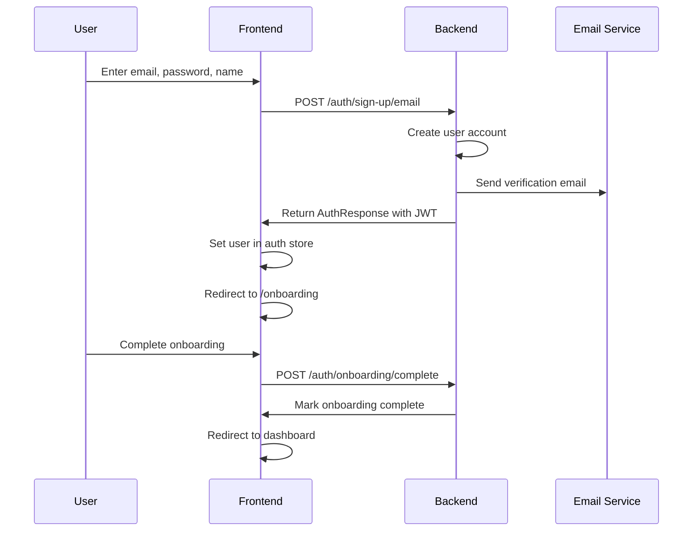
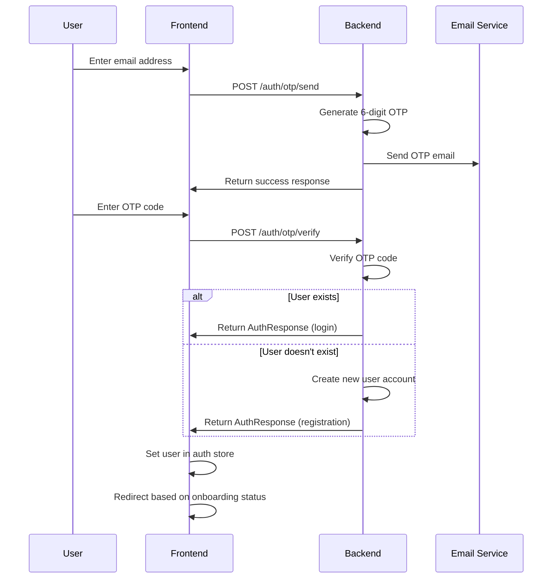
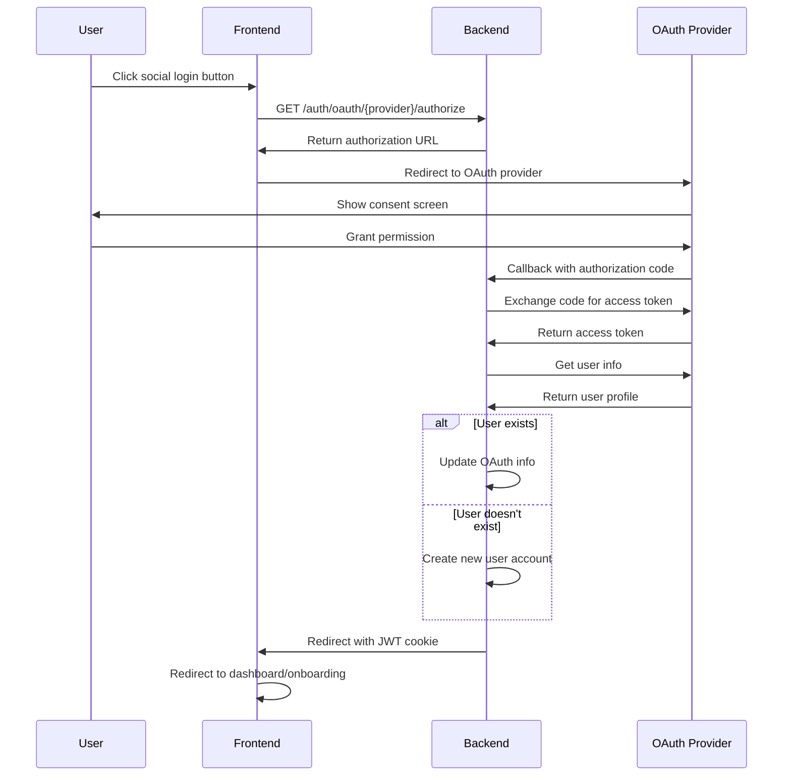
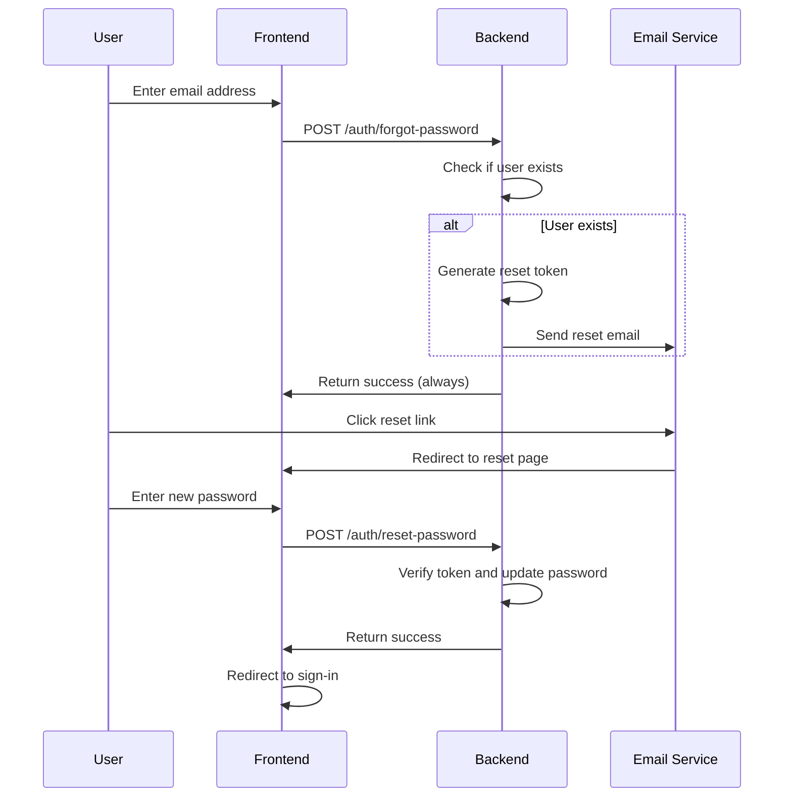

# Authentication Guide

This document provides a comprehensive overview of the authentication system implemented in this SaaS boilerplate.

## Overview

The authentication system supports multiple authentication methods:
- **Password-based authentication** (email + password)
- **OTP-based authentication** (email + verification code)
- **Social login** (Google, GitHub, Microsoft, Apple)
- **Email verification** for enhanced security
- **Onboarding flow** for new users

## Architecture

### Backend Components

#### 1. Better Auth Compatibility Layer (`src/auth/better_auth_compat.py`)
Provides Better Auth-compatible endpoints that work with FastAPI Users:
- `/auth/sign-in/email` - Email/password login
- `/auth/sign-up/email` - Email/password registration
- `/auth/forgot-password` - Password reset request
- `/auth/reset-password` - Password reset completion
- `/auth/session` - Get current session
- `/auth/sign-out` - Logout

#### 2. OTP Authentication (`src/auth/otp_routes.py`)
Passwordless authentication using email verification codes:
- `/auth/otp/send` - Send OTP code to email
- `/auth/otp/verify` - Verify OTP and complete login/registration

#### 3. Onboarding Routes (`src/auth/onboarding_routes.py`)
User onboarding and profile completion:
- `/auth/onboarding/status` - Get onboarding status
- `/auth/onboarding/profile` - Update user profile
- `/auth/onboarding/organization` - Create first organization
- `/auth/onboarding/step` - Update onboarding step
- `/auth/onboarding/complete` - Complete onboarding

#### 4. Email Routes (`src/auth/email_routes.py`)
Email verification and password reset:
- `/auth/forgot-password` - Request password reset
- `/auth/reset-password` - Reset password with token
- `/auth/verify-email` - Verify email with token
- `/auth/resend-verification` - Resend verification email

### Frontend Components

#### 1. Authentication Store (`src/stores/auth-store.ts`)
Centralized state management for authentication:
- User session management
- Login/logout functionality
- Error handling and message normalization

#### 2. Authentication Forms
- **Sign-up Form** (`src/features/auth/sign-up/components/sign-up-form.tsx`)
- **Sign-in Form** (`src/features/auth/sign-in/components/user-auth-form.tsx`)
- **OTP Form** (`src/features/auth/otp/components/otp-form.tsx`)
- **Forgot Password Form** (`src/features/auth/forgot-password/components/forgot-password-form.tsx`)

#### 3. Route Protection
- **Authenticated Routes** (`src/routes/_authenticated/route.tsx`) - Requires authentication and completed onboarding
- **Onboarding Route** (`src/routes/(auth)/onboarding.tsx`) - Requires authentication but not completed onboarding

## Authentication Flows

### 1. Password-Based Registration



### 2. OTP-Based Registration/Login



### 3. Social Login



### 4. Password Reset



## Security Features

### 1. JWT Tokens
- **Algorithm**: HS256
- **Lifetime**: Configurable (default: 24 hours)
- **Audience**: `fastapi-users:auth`
- **Issuer**: `better-auth-compat`

### 2. Password Security
- **Hashing**: Argon2 (via PassLib)
- **Minimum Requirements**: Enforced by frontend validation
- **Reset Tokens**: 1-hour expiration

### 3. OTP Security
- **Code Length**: 6 digits
- **Expiration**: 15 minutes
- **One-time Use**: Codes are deleted after verification
- **Rate Limiting**: Applied to prevent abuse

### 4. Email Verification
- **Verification Tokens**: 24-hour expiration
- **Required for**: Full dashboard access
- **Banner Display**: Shows when email not verified

### 5. Rate Limiting
- **Password Reset**: 3 requests per hour, 10 per day
- **Email Verification**: 10 requests per hour
- **OTP Requests**: Built-in rate limiting

## User States and Redirects

### User State Matrix

| Authentication | Email Verified | Onboarding Complete | Redirect Destination |
|---------------|----------------|-------------------|-------------------|
| ❌ | N/A | N/A | `/sign-in` |
| ✅ | ❌ | ❌ | `/onboarding` |
| ✅ | ✅ | ❌ | `/onboarding` |
| ✅ | ✅ | ✅ | `/` (dashboard) |

### Route Protection Logic

```typescript
// _authenticated route beforeLoad
if (!authState.user) {
  throw redirect({ to: '/sign-in' })
}

if (authState.user && !authState.user.onboarding_completed) {
  throw redirect({ to: '/onboarding' })
}
```

## API Endpoints Reference

### Authentication Endpoints

| Method | Endpoint | Description | Request Body | Response |
|--------|----------|-------------|--------------|----------|
| POST | `/auth/sign-in/email` | Email/password login | `{email, password}` | `AuthResponse` |
| POST | `/auth/sign-up/email` | Email/password registration | `{email, password, name?}` | `AuthResponse` |
| POST | `/auth/forgot-password` | Request password reset | `{email}` | `{success, message, user_exists}` |
| POST | `/auth/reset-password` | Reset password | `{token, password}` | `{success, message}` |
| GET | `/auth/session` | Get current session | - | `{user, session}` |
| POST | `/auth/sign-out` | Logout | - | `{success}` |

### OTP Endpoints

| Method | Endpoint | Description | Request Body | Response |
|--------|----------|-------------|--------------|----------|
| POST | `/auth/otp/send` | Send OTP code | `{email}` | `{success, message, user_exists}` |
| POST | `/auth/otp/verify` | Verify OTP | `{email, code, name?}` | `AuthResponse` |

### Onboarding Endpoints

| Method | Endpoint | Description | Request Body | Response |
|--------|----------|-------------|--------------|----------|
| GET | `/auth/onboarding/status` | Get onboarding status | - | `OnboardingStatus` |
| PATCH | `/auth/onboarding/profile` | Update profile | `OnboardingProfileUpdate` | `{success, user}` |
| POST | `/auth/onboarding/organization` | Create organization | `{name, slug?}` | `{success, organization}` |
| PATCH | `/auth/onboarding/step` | Update step | `{step, completed}` | `{success, onboarding_step}` |
| POST | `/auth/onboarding/complete` | Complete onboarding | `{completed}` | `{success}` |

## Error Handling

### Backend Error Format
```json
{
  "error": "ERROR_CODE",
  "message": "Human-readable error message"
}
```

### Common Error Codes
- `INVALID_CREDENTIALS` - Wrong email/password
- `USER_EXISTS` - Email already registered
- `USER_NOT_FOUND` - No account with email
- `INVALID_OTP` - Wrong or expired OTP
- `EMAIL_SEND_FAILED` - Email service error
- `RATE_LIMITED` - Too many requests

### Frontend Error Handling
- **Toast Notifications**: User-friendly error messages
- **Form Validation**: Real-time validation feedback
- **Rate Limiting**: Visual countdown timers
- **Retry Logic**: Automatic retry for transient errors

## Configuration

### Environment Variables

```bash
# JWT Configuration
JWT_SECRET=your-secret-key
JWT_LIFETIME_SECONDS=86400

# Email Configuration
RESEND_API_KEY=your-resend-key
RESEND_FROM_EMAIL=noreply@yourdomain.com

# OAuth Configuration
GOOGLE_CLIENT_ID=your-google-client-id
GOOGLE_CLIENT_SECRET=your-google-client-secret
GITHUB_CLIENT_ID=your-github-client-id
GITHUB_CLIENT_SECRET=your-github-client-secret

# Frontend URL
FRONTEND_URL=https://yourdomain.com
```

### Frontend Configuration

```typescript
// Vite environment variables
VITE_API_URL=http://localhost:8000
```

## Testing

### Backend Tests
- Unit tests for authentication logic
- Integration tests for API endpoints
- OTP flow testing
- Social login testing

### Frontend Tests
- Component testing for auth forms
- Integration testing for auth flows
- Error handling testing
- Route protection testing

## Troubleshooting

### Common Issues

1. **"User already exists" error on registration**
   - Check if user exists in database
   - Verify email uniqueness constraint

2. **OTP not received**
   - Check email service configuration
   - Verify email address validity
   - Check spam folder

3. **Social login redirect issues**
   - Verify OAuth provider configuration
   - Check redirect URLs match exactly
   - Ensure HTTPS in production

4. **Session not persisting**
   - Check JWT secret configuration
   - Verify cookie settings
   - Check CORS configuration

### Debug Mode

Enable debug logging:
```python
import logging
logging.getLogger('src.auth').setLevel(logging.DEBUG)
```

## Security Best Practices

1. **Always use HTTPS in production**
2. **Implement proper CORS policies**
3. **Use secure cookie settings**
4. **Regularly rotate JWT secrets**
5. **Monitor authentication attempts**
6. **Implement account lockout policies**
7. **Use strong password requirements**
8. **Enable email verification**
9. **Implement rate limiting**
10. **Log security events**

## Future Enhancements

- [ ] Multi-factor authentication (MFA)
- [ ] Device management
- [ ] Session management dashboard
- [ ] Advanced security policies
- [ ] Audit logging
- [ ] Account recovery options
- [ ] Biometric authentication
- [ ] Hardware security keys
